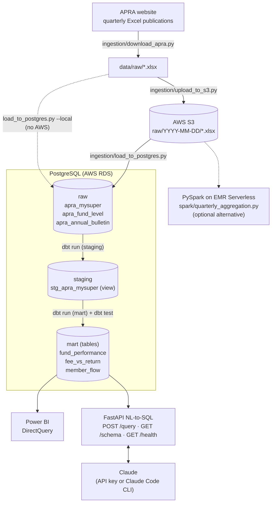

# Australian Superannuation Analytics Platform

End-to-end data pipeline on APRA's public regulatory data ($4.5T AUM industry) — automated ingestion, dbt transformations, AI-powered querying, and a live Power BI dashboard. Deployed on AWS with Docker and CI/CD.


## Stack

| Layer | Technology |
|-------|-----------|
| Ingestion | Python, requests, pandas, boto3 |
| Storage | AWS S3 (data lake) + AWS RDS PostgreSQL |
| Transformation | dbt (staging + mart models) |
| Orchestration | Apache Airflow on AWS EC2 |
| AI Query API | FastAPI + Claude API (NL-to-SQL) |
| Visualisation | Power BI DirectQuery → RDS |
| CI/CD | GitHub Actions (ruff + dbt compile + dbt test) |
| Containers | Docker + Docker Compose |
| Bonus | PySpark on EMR Serverless |

## Quick start (local)

```bash
git clone https://github.com/YOUR_USERNAME/apra-super-pipeline.git
cd apra-super-pipeline
cp .env.example .env          # fill in your credentials
docker-compose up             # spins up Airflow + API
```

Airflow UI: http://localhost:8080 (admin / admin)
Query API:  http://localhost:8000/docs

## Architecture



In production, Airflow (`airflow/dags/apra_pipeline.py`) runs the chain weekly
(`0 22 * * 0` UTC, i.e. Monday 8am AEST):
`download_apra_files → upload_to_s3 → load_to_postgres → dbt_run → dbt_test`, then posts a
success/failure message to Slack.

## Data sources

All public, no API key required:
- [APRA Quarterly MySuper Stats](https://www.apra.gov.au/quarterly-superannuation-statistics)
- [APRA Quarterly Fund-Level Stats](https://www.apra.gov.au/quarterly-fund-level-statistics)
- [APRA Annual Fund Bulletin](https://www.apra.gov.au/annual-superannuation-bulletin)

## dbt models

| Model | Type | Description |
|-------|------|-------------|
| `staging/stg_apra_mysuper` | view | Cleaned + typed raw data |
| `mart/fund_performance` | table | Returns ranked by peer group + fee percentile |
| `mart/fee_vs_return` | table | Value quadrant classification (best/worst value) |
| `mart/member_flow` | table | Net member inflows/outflows per quarter |

## AI query examples

```bash
curl -X POST http://localhost:8000/query \
  -H "Content-Type: application/json" \
  -d '{"question": "Which fund had the best 5yr return under 0.5% fees?"}'

curl -X POST http://localhost:8000/query \
  -d '{"question": "Which 3 funds lost the most members last quarter?"}'
```

## GitHub Actions CI/CD

- **PR check** — `ruff` linter + `pytest` unit tests + `dbt compile` on every pull request
- **dbt test** — full `dbt run` + `dbt test` on merge to main
- **Docker build** — confirms the API image builds cleanly on every push

## Reproduce locally (no AWS required)

Runs the same steps as the Airflow DAG by hand, against any PostgreSQL instance, skipping S3.

**Prerequisites:** Python 3.12+ (dbt: 3.12/3.13), a PostgreSQL database you can create
schemas in, and either an `ANTHROPIC_API_KEY` or a logged-in Claude Code CLI (`claude`) for
the query API.

1. **Configure environment**

   ```bash
   cp .env.example .env
   # Set POSTGRES_HOST / POSTGRES_PORT / POSTGRES_DB / POSTGRES_USER / POSTGRES_PASSWORD.
   # AWS_* and S3_BUCKET are only needed for the S3 path; SLACK_WEBHOOK_URL is optional.
   ```

   No Postgres handy? A throwaway one works:

   ```bash
   docker run -d --name apra-pg -p 5432:5432 \
     -e POSTGRES_USER=pipeline_user -e POSTGRES_PASSWORD=pipeline \
     -e POSTGRES_DB=superannuation postgres:16-alpine
   ```

2. **Install ingestion dependencies**

   ```bash
   python -m venv .venv && source .venv/bin/activate   # Windows: .venv\Scripts\activate
   pip install -r requirements-local.txt
   ```

3. **Download and load the APRA data** (run from the repo root)

   ```bash
   python -m ingestion.download_apra              # writes data/raw/*.xlsx
   python -m ingestion.load_to_postgres --local   # data/raw/ -> raw.* tables
   ```

   With AWS configured, use the S3 path instead:
   `python -m ingestion.upload_to_s3 && python -m ingestion.load_to_postgres`.

4. **Build and test the dbt models** (dbt has its own requirements file; a separate venv is recommended)

   ```bash
   pip install -r requirements-dbt.txt
   mkdir -p ~/.dbt && cp dbt_project/profiles.yml.example ~/.dbt/profiles.yml
   # profiles.yml reads POSTGRES_* from the shell, not from .env — export them first.
   cd dbt_project && dbt run && dbt test && cd ..
   ```

5. **Run the query API**

   ```bash
   pip install -r requirements-api.txt
   uvicorn api.main:app --reload --port 8000
   ```

   Open http://localhost:8000/docs, or use the `curl` examples above.

6. **Run the checks CI runs on every PR**

   ```bash
   ruff check ingestion/ api/ spark/ tests/
   pytest -q
   ```

